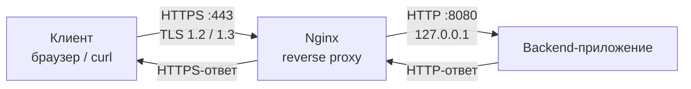

# Настройка HTTPS на Nginx с reverse proxy для backend-приложения

Инструкция описывает, как развернуть Nginx перед backend-приложением, включить TLS с самоподписанным сертификатом и проксировать запросы на порт `8080`. После выполнения всех шагов клиенты обращаются к сервису только по HTTPS, а backend остаётся доступен исключительно на локальном интерфейсе.

:::note
Самоподписанный сертификат подходит для внутренних стендов и тестовых окружений. Для production используйте сертификат от доверенного удостоверяющего центра, например выпущенный через Let's Encrypt: порядок настройки server block при этом не меняется, отличаются только значения `ssl_certificate` и `ssl_certificate_key`.
:::

## Схема работы

Nginx терминирует TLS: шифрование заканчивается на нём, дальше трафик идёт по локальной сети незашифрованным. Backend узнаёт исходный протокол и IP-адрес клиента из заголовков `X-Forwarded-Proto` и `X-Forwarded-For`, которые Nginx добавляет к запросу.

## Prerequisites

Перед началом убедитесь, что выполнены следующие условия.

| Условие | Как проверить |
|---|---|
| ОС Ubuntu 22.04 LTS или Debian 12 (для других дистрибутивов отличаются только команды пакетного менеджера и пути) | `cat /etc/os-release` |
| Права `sudo` на сервере | `sudo -v` |
| Backend-приложение запущено и слушает порт `8080` | `ss -tlnp \| grep 8080` |
| Порты 80 и 443 не заняты другими сервисами и открыты в межсетевом экране | `ss -tlnp \| grep -E ':80\|:443'`, `sudo ufw status` |
| Установлен OpenSSL | `openssl version` |
| Для сервера определено доменное имя или зафиксирован IP-адрес | `hostname -f`, `ip -4 addr` |

В примерах используются:

- доменное имя `app.example.internal`;
- backend по адресу `127.0.0.1:8080`;
- каталог для сертификатов `/etc/nginx/ssl`.

Замените их на значения своего стенда.
